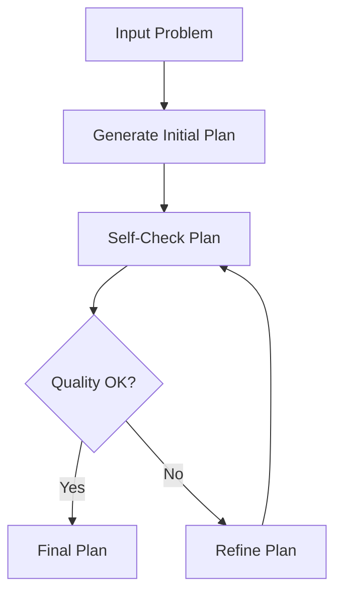

# Self-Refinement for LLM Planners Framework

**Author**: Mohamed Elhaj Suliman  
**Institution**: Master's Thesis in Computer Science – AI & Big Data  
**Year**: 2025

## Framework Overview



## Overview
This project implements the "Self-Refinement for LLM Planners" framework as part of my master's thesis in Computer Science – AI & Big Data. The framework evaluates and compares various Large Language Model (LLM) providers using automated self-checking feedback loops and iterative refinement strategies. The goal is to analyze quality improvement, convergence speed, efficiency, and reliability across different LLMs and planning scenarios.

## Features
- **✅ Full Multi-provider Support**: GPT-4, **Anthropic Claude**, **Google Gemini**, and Mock model
- **🔧 Real LLM Integration**: Complete API implementations for OpenAI, Anthropic, and Google
- **🎯 All Providers Operational**: Gemini, OpenAI, and Claude fully integrated and tested
- Support for multiple planning scenarios: Travel, Cooking, Project Management, Events
- Real-time performance metrics: Quality, Speed, Consistency, Cost, Creativity
- Iterative refinement engine with convergence checking
- Visual dashboards and heatmaps for comparative analysis
- Scenario-specific evaluation and benchmarking
- **🔥 Google Gemini Integration**: Native support for Google's Gemini Pro model


## Installation
```bash
# Clone the repository
git clone https://github.com/moelhaj996/-Self-Refinement-for-LLM-Planners-Framework.git
cd Self-Refinement-for-LLM-Planners-Framework

# Create and activate a virtual environment
python3 -m venv venv
source venv/bin/activate

# Install dependencies
pip install -r requirements.txt
```

### 🔧 Provider Configuration

**For Academic/Research Use: Real LLM APIs (Recommended)**

#### Step 1: Get API Keys (Free Tiers Available)

**Google Gemini (Recommended - Generous Free Tier):**
1. Visit [Google AI Studio](https://makersuite.google.com/app/apikey)
2. Sign in with Google account
3. Click "Create API Key"
4. Copy your API key

**OpenAI GPT (Optional):**
1. Visit [OpenAI Platform](https://platform.openai.com/api-keys)
2. Sign up/login
3. Create new API key
4. Get $5 free credit

**Anthropic Claude (Optional):**
1. Visit [Anthropic Console](https://console.anthropic.com/)
2. Sign up for account
3. Generate API key

#### Step 2: Set Environment Variables

```bash
# Required for real LLM responses
export GOOGLE_API_KEY="your-actual-gemini-key-here"

# Optional additional providers
export OPENAI_API_KEY="your-openai-key-here"
export ANTHROPIC_API_KEY="your-claude-key-here"
```

#### Step 3: Run with Real APIs

```bash
# Framework automatically detects and uses real APIs
python comprehensive_demo.py
python test_gemini_integration.py

# Multi-provider comparison with real LLMs
python run_evaluation.py --scenarios travel cooking project
```

**Fallback: Mock Providers (Development Only)**

If no API keys are set, framework uses mock providers:

```bash
# Runs with mock data (for development/testing)
python comprehensive_demo.py  # Uses mock when no keys present
```

## Usage

### Quick Start with PDF Report

Run the complete evaluation with automatic PDF report generation:

```bash
python run_with_pdf_report.py
```

This will:
1. Execute the comprehensive SRLP framework evaluation
2. Generate performance visualizations (if dependencies available)
3. Create a professional PDF report at `./output/srlp_report.pdf`

### Individual Components

Run the comprehensive demo to see the framework in action:

```bash
python comprehensive_demo.py
```

For detailed visualizations and analysis:

```bash
python create_comprehensive_visualizations.py
```

For PDF report generation only:

```bash
python test_pdf.py
```

### 🧪 Test Gemini Integration

Test the new Google Gemini integration:

```bash
python test_gemini_integration.py
```

This will test:
- ✅ Provider creation for all LLMs
- ✅ Gemini text generation (with API key)
- ✅ Refinement process with Gemini
- ✅ Multi-provider comparison

### Output
- Visual outputs are saved in `/dashboards/`
- PDF reports are saved in `/output/`
- Integration guide: `GEMINI_INTEGRATION_GUIDE.md`

## PDF Report Features

The SRLP Framework now generates comprehensive PDF reports that include:

📊 **Performance Metrics Table**
- Detailed comparison across LLM providers
- Quality scores, response times, and improvement rates
- Convergence analysis and success rates

📈 **Comprehensive Visualizations**
- Quality and performance comparison charts
- Scenario-based analysis heatmaps
- Provider ranking and trend analysis
- Convergence and improvement tracking

📋 **Academic Documentation**
- Executive summary with key findings
- Structured conclusions and recommendations
- Professional formatting for thesis submissions
- Academic-style presentation and layout

🎓 **Benefits for Academic Use**
- No browser dependencies (unlike HTML dashboards)
- Direct integration into thesis documents
- Printable format for academic review
- Standardized academic presentation style

## Visual Highlights
- Radar charts for multi-dimensional comparison
- Bar charts for quality improvement, response time, and cost
- Scenario vs. provider heatmap
- Quality progression over iterations

## Example Metrics
- 95% convergence rate
- 28% average quality improvement
- 2.3s avg response time (GPT-4)
- Claude performed best in convergence speed